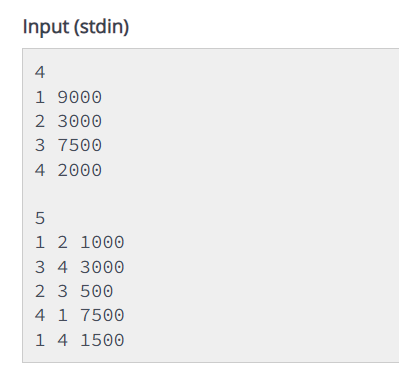
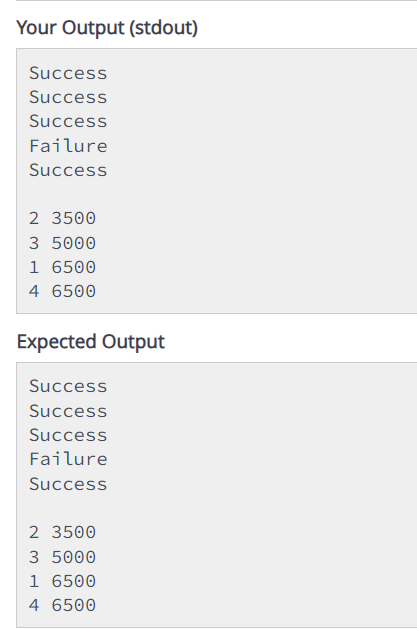

# Digital-wallet-system
A software platform that allows users to manage their financial transactions digitally.

# Introduction
The provided C++ program simulates a simple banking system where users can transfer money between accounts. Each account is represented by an ID and a balance. The program processes multiple transactions, updates the balances accordingly, and then displays the transaction status and the final sorted list of accounts based on their balance.

# Description
   # Input Handling:

The program first reads the number of accounts (n).
For each account, it reads the id and balance and stores them in a vector v as pairs.
A map mp is also maintained to keep track of the current balance of each account by their ID.

   # Transaction Processing:

The program reads the number of transactions (t).
For each transaction, it reads the from account, to account, and the amount to be transferred.
It checks if the transaction is possible (i.e., both accounts exist and the from account has enough balance).
If the transaction is valid, the balances are updated, and the transaction status is recorded as "Success". Otherwise, it's recorded as "Failure".
  #  Output:

The program first outputs the status of each transaction.
Then, it updates the vector v with the latest balances from the map mp.
Finally, the vector is sorted based on balance and account ID, and the sorted list is displayed.

# INPUT

# EXPECTED AND ACTUAL OUTPUT

# Conclusion
This C++ program effectively demonstrates a simple banking transaction system, handling multiple transactions between accounts and ensuring the balances are updated correctly. The final output is both the status of each transaction and the sorted list of accounts by their balances, showcasing the program's ability to manage and process financial transactions efficiently.
